# SEO Architecture — TaxExpertWitness.co.uk

**Site:** https://www.taxexpertwitness.co.uk  
**Domain:** taxexpertwitness.co.uk (.co.uk — natural UK geotargeting)  
**Last updated:** June 2025

This document is the single source of truth for keyword strategy, content clusters, geo-targeting, AI-citation assets, off-page targets, and deployment checklist.

---

## Implementation Status

| Asset | File | Status |
|-------|------|--------|
| Metadata helper | `lib/metadata.ts` | Live — `createMetadata()` with canonical, `x-default` hreflang, OG `en_GB`, robots |
| JSON-LD schemas | `lib/schema.ts` | Live — FAQ, breadcrumb, article, homepage, services, `DefinedTermSet` |
| Site constants | `lib/site.ts` | `SITE_URL`, LinkedIn URL defined |
| Apex → www redirect | `middleware.ts` | 301 to `www.taxexpertwitness.co.uk` |
| Content data + routes | `lib/data/*`, `app/**/page.tsx` | 10 dispute types, 4 tribunals, 5 HMRC types, 6 guides, 8 services — all routed |
| Root layout | `app/layout.tsx` | `lang="en-GB"`, site metadata, verification meta from env |
| Sitemap / robots | `scripts/generate-seo.ts` → `public/sitemap.xml`, `public/robots.txt` | 48 URLs; `npm run seo:verify` in build |
| GEO citation tables | Pillar/hub pages | FTT jurisdiction, appeal structure, HMRC types, COP8 vs COP9, TP methods, expert vs forensic |
| Glossary | `/glossary` | 35 terms, stable anchor IDs (`#ftt`, `#mtic`, `#cop9`, etc.), `DefinedTermSet` schema |
| Removed routes | `/fees`, `/faq`, `/experts` | Intentionally removed; keywords redirected to `/how-to-instruct`, `/qualifications`, `/contact` |

Service deep links use `/services/[slug]` (not `#fragment` anchors). Run `npm run seo:generate` before deploy to refresh sitemap.

---

## 1. Keyword Strategy

Keywords are grouped by intent. Each keyword maps to a **primary target URL** (canonical path from `lib/data/*` where applicable).

### Tier 1 — Transactional

High-intent searches from solicitors and litigators instructing expert witnesses.

| Keyword | Primary target URL |
|---------|-------------------|
| tax expert witness UK | `/` |
| tax expert witness .co.uk | `/` |
| tax expert witness | `/` |
| HMRC tax expert witness UK | `/services/hmrc-methodology-challenge` |
| FTT tax expert witness UK | `/tribunals-courts/first-tier-tribunal-tax` |
| tax tribunal expert witness UK | `/tribunals-courts` |
| VAT expert witness UK | `/tax-dispute-types/vat-mtic-fraud-disputes` |
| transfer pricing expert witness UK | `/tax-dispute-types/transfer-pricing-disputes` |
| COP9 expert witness UK | `/hmrc-investigation-types/code-of-practice-9-cop9` |
| tax professional negligence expert witness UK | `/tax-dispute-types/tax-professional-negligence` |

### Tier 2 — Informational

Research-phase queries from solicitors building case strategy.

| Keyword | Primary target URL |
|---------|-------------------|
| what is a tax expert witness UK | `/what-is-a-tax-expert-witness` |
| how to challenge HMRC methodology | `/guides/hmrc-methodology-challenge-guide` |
| FTT expert evidence procedure UK | `/guides/ftt-procedure-expert-evidence` |
| MTIC VAT fraud knowledge test | `/guides/vat-mtic-knowledge-test` |
| transfer pricing arm's length expert | `/tax-dispute-types/transfer-pricing-disputes` |
| COP8 vs COP9 HMRC investigation | `/hmrc-investigation-types` |
| IHT BPR dispute expert witness UK | `/tax-dispute-types/iht-business-property-relief` |
| tax expert witness fees UK | `/how-to-instruct` |
| when to instruct tax expert FTT | `/how-to-instruct` |
| difference tax expert forensic accountant UK | `/what-is-a-tax-expert-witness` |

### Tier 3 — Long-tail

Specific dispute and procedure queries with lower volume but high conversion potential.

| Keyword | Primary target URL |
|---------|-------------------|
| First-tier Tribunal tax expert witness UK | `/tribunals-courts/first-tier-tribunal-tax` |
| HMRC business reconstruction challenge expert | `/tax-dispute-types/hmrc-business-records-reconstruction` |
| MTIC VAT input tax expert UK | `/tax-dispute-types/vat-mtic-fraud-disputes` |
| transfer pricing HMRC enquiry expert witness | `/hmrc-investigation-types/transfer-pricing-enquiry` |
| COP9 contractual disclosure forensic expert | `/hmrc-investigation-types/code-of-practice-9-cop9` |
| IHT business property relief expert witness | `/tax-dispute-types/iht-business-property-relief` |
| CGT share disposal HMRC SAV expert | `/tax-dispute-types/cgt-share-disposal-valuation` |
| employment related securities tax expert UK | `/tax-dispute-types/employment-related-securities` |
| SDLT planning challenge expert witness | `/tax-dispute-types/sdlt-property-transactions` |
| GAAR tax avoidance expert UK | `/tax-dispute-types/corporate-tax-avoidance-schemes` |

---

## 2. Content Cluster Map

Eight thematic hubs with supporting pages. Hub pages receive highest internal link equity; supporting pages cross-link within cluster and link up to hub.

### Cluster diagram

```mermaid
flowchart TB
  subgraph hub8 [Hub8_TaxDisputesExplained]
    pillar["/tax-disputes-explained"]
  end
  subgraph hub1 [Hub1_FTT]
    ftt["/tribunals-courts"]
    fttChild["/tribunals-courts/first-tier-tribunal-tax"]
    fttGuide["/guides/ftt-procedure-expert-evidence"]
  end
  subgraph hub2 [Hub2_HMRCMethodology]
    meth["/guides/hmrc-methodology-challenge-guide"]
    recon["/tax-dispute-types/hmrc-business-records-reconstruction"]
  end
  subgraph hub3 [Hub3_VAT_MTIC]
    vat["/tax-dispute-types/vat-mtic-fraud-disputes"]
    mticGuide["/guides/vat-mtic-knowledge-test"]
    mticInv["/hmrc-investigation-types/mtic-vat-fraud-investigation"]
  end
  subgraph hub4 [Hub4_TransferPricing]
    tp["/tax-dispute-types/transfer-pricing-disputes"]
    tpGuide["/guides/transfer-pricing-expert-guide"]
    tpInv["/hmrc-investigation-types/transfer-pricing-enquiry"]
  end
  subgraph hub5 [Hub5_COP8_COP9]
    cop8["/hmrc-investigation-types/code-of-practice-8-cop8"]
    cop9["/hmrc-investigation-types/code-of-practice-9-cop9"]
  end
  subgraph hub6 [Hub6_ProfNeg]
    neg["/tax-dispute-types/tax-professional-negligence"]
    negGuide["/guides/tax-professional-negligence"]
  end
  subgraph hub7 [Hub7_IHT_CGT]
    iht["/tax-dispute-types/iht-business-property-relief"]
    cgt["/tax-dispute-types/cgt-share-disposal-valuation"]
  end
  pillar --> ftt
  pillar --> meth
  pillar --> vat
  pillar --> tp
  pillar --> cop8
  pillar --> neg
  pillar --> iht
  ftt --> fttChild
  ftt --> fttGuide
  meth --> recon
  vat --> mticGuide
  vat --> mticInv
  tp --> tpGuide
  tp --> tpInv
  neg --> negGuide
  iht --> cgt
```



### Hub 1: FTT Procedure & Expert Evidence

**Hub page:** `/tribunals-courts`

| Supporting page | Status | Notes |
|----------------|--------|-------|
| `/tribunals-courts/first-tier-tribunal-tax` | Data ready | `lib/data/tribunals-courts.ts` |
| `/tribunals-courts/upper-tribunal-tax` | Data ready | |
| `/tribunals-courts/court-of-appeal-tax` | Data ready | |
| `/tribunals-courts/alternative-dispute-resolution-hmrc` | Data ready | |
| `/guides/ftt-procedure-expert-evidence` | Planned | |
| `/tax-disputes-explained` (FTT section) | Planned | Pillar page — FTT jurisdiction table |
| `/glossary#ftt` | Planned | |
| `/qualifications` (FTT / CPR Part 35) | Live | |

**Tier keywords:** FTT tax expert witness UK, tax tribunal expert witness UK, FTT expert evidence procedure UK, when to instruct tax expert FTT

### Hub 2: HMRC Methodology Challenge

**Hub page:** `/guides/hmrc-methodology-challenge-guide`

| Supporting page | Status | Notes |
|----------------|--------|-------|
| `/tax-dispute-types/hmrc-business-records-reconstruction` | Data ready | `lib/data/tax-dispute-types.ts` |
| `/hmrc-investigation-types/code-of-practice-8-cop8` | Referenced | Linked from dispute type |
| `/what-is-a-tax-expert-witness` (methodology section) | Planned | |
| `/services/hmrc-methodology-challenge` | Live | `app/services/[slug]/page.tsx` |
| `/glossary#mark-up-analysis` | Planned | |

**Tier keywords:** HMRC tax expert witness UK, how to challenge HMRC methodology, HMRC business reconstruction challenge expert

### Hub 3: VAT / MTIC

**Hub page:** `/tax-dispute-types/vat-mtic-fraud-disputes`

| Supporting page | Status | Notes |
|----------------|--------|-------|
| `/guides/vat-mtic-knowledge-test` | Planned | Unique technical asset |
| `/hmrc-investigation-types/mtic-vat-fraud-investigation` | Referenced | |
| `/services/vat-dispute-evidence` | Live | |
| `/glossary#mtic` | Planned | |
| `/glossary#mobilx-v-hmrc` | Planned | |

**Tier keywords:** VAT expert witness UK, MTIC VAT fraud knowledge test, MTIC VAT input tax expert UK

### Hub 4: Transfer Pricing

**Hub page:** `/tax-dispute-types/transfer-pricing-disputes`

| Supporting page | Status | Notes |
|----------------|--------|-------|
| `/guides/transfer-pricing-expert-guide` | Planned | |
| `/hmrc-investigation-types/transfer-pricing-enquiry` | Referenced | |
| `/services/transfer-pricing-evidence` | Live | |
| `/glossary#transfer-pricing` | Planned | |
| `/glossary#oecd-beps` | Planned | |

**Tier keywords:** transfer pricing expert witness UK, transfer pricing arm's length expert, transfer pricing HMRC enquiry expert witness

### Hub 5: COP8 / COP9

**Hub page:** `/hmrc-investigation-types`

| Supporting page | Status | Notes |
|----------------|--------|-------|
| `/hmrc-investigation-types/code-of-practice-8-cop8` | Referenced | |
| `/hmrc-investigation-types/code-of-practice-9-cop9` | Referenced | |
| `/services/cop8-cop9-support` | Live | |
| `/glossary#cop8` | Planned | |
| `/glossary#cop9` | Planned | |

**Tier keywords:** COP9 expert witness UK, COP8 vs COP9 HMRC investigation, COP9 contractual disclosure forensic expert

### Hub 6: Tax Professional Negligence

**Hub page:** `/tax-dispute-types/tax-professional-negligence`

| Supporting page | Status | Notes |
|----------------|--------|-------|
| `/guides/tax-professional-negligence` | Planned | |
| `/services/tax-professional-negligence` | Live | |
| `/glossary#pcrt` | Planned | |

**Tier keywords:** tax professional negligence expert witness UK

### Hub 7: IHT & CGT Valuations

**Hub page:** `/tax-dispute-types/iht-business-property-relief`

| Supporting page | Status | Notes |
|----------------|--------|-------|
| `/tax-dispute-types/cgt-share-disposal-valuation` | Data ready | |
| `/services/iht-cgt-valuation` | Live | |
| `/glossary#bpr` | Planned | |
| `/glossary#badr` | Planned | |

**Tier keywords:** IHT BPR dispute expert witness UK, IHT business property relief expert witness, CGT share disposal HMRC SAV expert

### Hub 8: Tax Disputes Explained (Master Pillar)

**Hub page:** `/tax-disputes-explained`

| Supporting pages | Status |
|-----------------|--------|
| All `/tax-dispute-types` (10 slugs) | Data ready |
| All `/tribunals-courts` (4 slugs) | Data ready |
| All `/hmrc-investigation-types` (5 slugs) | Referenced |

**Tier keywords:** what is a tax expert witness UK, difference tax expert forensic accountant UK

### Canonical URL mapping

Brief paths from initial SEO planning are mapped to canonical codebase slugs. Always use the canonical path in links, sitemap, and metadata.

| Brief / shorthand path | Canonical path (codebase) |
|------------------------|---------------------------|
| `/tribunals-courts/first-tier-tribunal` | `/tribunals-courts/first-tier-tribunal-tax` |
| `/tax-dispute-types/vat-mtic-fraud` | `/tax-dispute-types/vat-mtic-fraud-disputes` |
| `/tax-dispute-types/hmrc-reconstruction` | `/tax-dispute-types/hmrc-business-records-reconstruction` |
| `/hmrc-investigation-types/hmrc-business-reconstruction` | `/tax-dispute-types/hmrc-business-records-reconstruction` |
| `/hmrc-investigation-types/cop8` | `/hmrc-investigation-types/code-of-practice-8-cop8` |
| `/hmrc-investigation-types/cop9` | `/hmrc-investigation-types/code-of-practice-9-cop9` |
| `/hmrc-investigation-types/mtic-vat-fraud` | `/hmrc-investigation-types/mtic-vat-fraud-investigation` |
| `/hmrc-investigation-types/transfer-pricing` | `/hmrc-investigation-types/transfer-pricing-enquiry` |
| `/guides/hmrc-methodology-challenge` | `/guides/hmrc-methodology-challenge-guide` |
| `/what-is-a-tax-expert` | `/what-is-a-tax-expert-witness` |

### Full slug inventory

**Tax dispute types** (`lib/data/tax-dispute-types.ts`):

- `vat-mtic-fraud-disputes`
- `transfer-pricing-disputes`
- `employment-related-securities`
- `sdlt-property-transactions`
- `iht-business-property-relief`
- `cgt-share-disposal-valuation`
- `corporate-tax-avoidance-schemes`
- `tax-professional-negligence`
- `poca-tax-fraud-proceedings`
- `hmrc-business-records-reconstruction`

**Tribunals & courts** (`lib/data/tribunals-courts.ts`):

- `first-tier-tribunal-tax`
- `upper-tribunal-tax`
- `court-of-appeal-tax`
- `alternative-dispute-resolution-hmrc`

**HMRC investigation types** (referenced in data; `lib/data/hmrc-investigation-types.ts` pending):

- `code-of-practice-8-cop8`
- `code-of-practice-9-cop9`
- `mtic-vat-fraud-investigation`
- `transfer-pricing-enquiry`
- `hmrc-criminal-investigation`

**Guides** (planned routes):

- `/guides/ftt-procedure-expert-evidence`
- `/guides/vat-mtic-knowledge-test`
- `/guides/transfer-pricing-expert-guide`
- `/guides/tax-professional-negligence`
- `/guides/hmrc-methodology-challenge-guide` (linked from `lib/data/services.ts`)
- `/guides/hmrc-enforcement-update-2025` (linked from `components/AlertBanner.tsx`)

---

## 3. .co.uk Advantage

The `taxexpertwitness.co.uk` domain provides natural UK geotargeting without requiring a separate country subdirectory or ccTLD redirect strategy.

### Geotargeting rules

1. **Google Search Console:** Verify property as `https://www.taxexpertwitness.co.uk`. Confirm country target = **United Kingdom** (Settings → International Targeting).
2. **No `en-US` hreflang:** Single-locale site; no US variant needed.
3. **`x-default` only:** Signal default locale for international crawlers.

### Implementation in `app/layout.tsx`

```ts
import { SITE_URL } from "@/lib/site";

export const metadata: Metadata = {
  metadataBase: new URL(SITE_URL),
  alternates: {
    canonical: SITE_URL,
    languages: { "x-default": SITE_URL },
  },
  // ...
};

// <html lang="en-GB">
```

Extend `lib/metadata.ts` `createMetadata()` to include `alternates.languages: { "x-default": url }` on every page for consistency.

### Locale consistency

| Signal | Value | File |
|--------|-------|------|
| `<html lang>` | `en-GB` | `app/layout.tsx` |
| OpenGraph locale | `en_GB` | `lib/metadata.ts` |
| Schema `inLanguage` | `en-GB` | `lib/schema.ts` |

---

## 4. Unique Content Assets

Five differentiators with no direct competitor equivalent. Prioritise these in content builds and digital PR.

| # | Asset | Target URL | Competitor gap |
|---|-------|------------|----------------|
| 1 | Dedicated tribunal hub | `/tribunals-courts` | No competitor has a standalone tribunal guide hub |
| 2 | Dedicated investigation hub | `/hmrc-investigation-types` | Unique in market — COP8/COP9/MTIC/TP/criminal in one hub |
| 3 | HMRC v Harte [2026] case law | Guide or `/tax-disputes-explained` | Live case law content — high AI citation potential |
| 4 | HMRC enforcement update 2025 | `/guides/hmrc-enforcement-update-2025` | Timely; no competitor has dedicated enforcement guide |
| 5 | MTIC knowledge test methodology | `/guides/vat-mtic-knowledge-test` + `/tax-dispute-types/vat-mtic-fraud-disputes` | Specific, technical; no competitor targets this query |

---

## 5. GEO Targets (AI Citation)

Structured tables and reference content designed for AI search citation (Perplexity, Google AI Overviews, ChatGPT browsing). Each asset should use semantic HTML tables and appropriate JSON-LD.

| # | Asset | Target page | Schema type |
|---|-------|-------------|-------------|
| 1 | FTT jurisdiction table | `/tax-disputes-explained` | `FAQPage` + semantic `<table>` |
| 2 | Four-level appeal structure | `/tax-disputes-explained` | `FAQPage` + semantic `<table>` |
| 3 | HMRC investigation types table | `/tax-disputes-explained` | `FAQPage` + semantic `<table>` |
| 4 | MTIC knowledge test explained | `/tax-dispute-types/vat-mtic-fraud-disputes` | `FAQPage` via `faqSchema()` |
| 5 | Transfer pricing methods table | `/tax-dispute-types/transfer-pricing-disputes` | `FAQPage` + semantic `<table>` |
| 6 | COP8 vs COP9 comparison | `/hmrc-investigation-types` | `FAQPage` + semantic `<table>` |
| 7 | Tax expert vs forensic accountant comparison | `/what-is-a-tax-expert-witness` | `FAQPage` + semantic `<table>` |
| 8 | UK tax dispute statistics table | `/` (homepage) | `homepageSchema()` in `lib/schema.ts` |
| 9 | Glossary (35 terms) | `/glossary` | `DefinedTermSet` |
| 10 | HMRC methodology challenge case example | `/guides/hmrc-methodology-challenge-guide` | `Article` via `articleSchema()` |

### Glossary anchor IDs (planned)

Key glossary terms referenced across clusters:

`#ftt`, `#mtic`, `#mobilx-v-hmrc`, `#transfer-pricing`, `#oecd-beps`, `#cop8`, `#cop9`, `#pcrt`, `#bpr`, `#badr`, `#mark-up-analysis`, `#gaar`, `#sav`, `#cdf`, `#cpr-part-35`

Full glossary target: **35 terms**.

---

## 6. Off-Page Targets

### Directories

| Directory | Action |
|-----------|--------|
| jspubs | Submit firm listing |
| Academy (Expert Witness Institute) | Submit expert witness directory entry |
| EWI (Expert Witness Institute) | Submit listing |
| CIOT member directory | Chartered Institute of Taxation — member/expert listing |
| ATT directory | Association of Tax Technicians — member listing |

### Publications

Target bylined articles and expert commentary in:

- Taxation Magazine
- Tax Adviser (CIOT)
- Tax Journal
- Lexology — Tax
- Practical Law Tax

### Digital PR — article titles

1. **HMRC Transfer Pricing Enforcement Surge 2025: What Groups Need**
2. **HMRC v Harte [2026]: What the Discovery Assessment Ruling Means**
3. **MTIC VAT Fraud Defence: When Expert Evidence Wins**
4. **COP9 in 2025–2026: HMRC's Shifting Approach**

Each article should link to the relevant hub page and include a CTA to `/contact` or `/how-to-instruct`.

---

## 7. Deployment Checklist

Pre-launch and post-launch SEO tasks cross-referenced to repo files.

### Infrastructure

- [ ] **Vercel deploy** — connect repo; set production domain `taxexpertwitness.co.uk` and `www.taxexpertwitness.co.uk`
- [ ] **DNS** — apex and www CNAME/A records pointing to Vercel (middleware in `middleware.ts` already 301-redirects apex → www)
- [ ] **All env vars set** in Vercel production (see `.env.example`):
  - `NEXT_PUBLIC_SITE_URL=https://www.taxexpertwitness.co.uk`
  - `NEXT_PUBLIC_FORMSPREE_ID`
  - `NEXT_PUBLIC_GA_MEASUREMENT_ID`
  - `GOOGLE_SITE_VERIFICATION`
  - `BING_SITE_VERIFICATION`

### On-page SEO

- [ ] **`app/layout.tsx`** — replace create-next-app defaults:
  - `lang="en-GB"`
  - Site-wide metadata via `createMetadata()` from `lib/metadata.ts`
  - `x-default` hreflang via `alternates.languages`
  - Google/Bing verification meta tags from env vars
- [ ] **`lib/metadata.ts`** — add `alternates.languages: { "x-default": url }` to `createMetadata()`
- [ ] **Per-page `generateMetadata()`** — wire `metaTitle` / `metaDescription` from `lib/data/*` on all dynamic routes
- [ ] **`app/sitemap.ts`** — all ~40 routes; hub pages priority 0.9, child pages 0.7, legal/utility 0.3
- [ ] **`app/robots.ts`** — allow all crawlers; reference sitemap URL

### Search Console & analytics

- [ ] **Google Search Console** — verify `www.taxexpertwitness.co.uk`; confirm UK geotargeting
- [ ] **Bing Webmaster Tools** — verify domain
- [ ] **GA4** — `NEXT_PUBLIC_GA_MEASUREMENT_ID` wired in layout

### Content pages (build order)

1. `/` — homepage with UK tax dispute statistics table (GEO target #8)
2. `/tax-disputes-explained` — master pillar with three tables (GEO targets #1–3)
3. `/tribunals-courts` + 4 child slugs
4. `/hmrc-investigation-types` + 5 child slugs
5. `/tax-dispute-types` + 10 child slugs
6. `/services`, `/what-is-a-tax-expert-witness`, `/guides` + 6 guide slugs
7. `/glossary`, `/how-to-instruct`, `/contact`, `/qualifications`
8. `/privacy`, `/terms`, `app/not-found.tsx`

### Off-page

- [ ] **LinkedIn:** [TaxExpertWitness](https://www.linkedin.com/company/taxexpertwitness) — profile complete (URL in `lib/site.ts`)
- [ ] **Directory submissions:** jspubs, Academy, EWI, CIOT, ATT
- [ ] **Digital PR:** publish 4 article titles from Section 6

---

## 8. Internal Linking Rules

Conventions for page builds to maximise cluster authority and crawl efficiency.

### Hub → supporting

- Every hub page links to all supporting pages in its cluster (listed in Section 2).
- Hub pages include a "Related guides" or "In this section" block with 3–6 contextual links.

### Supporting → hub

- Every child page (`/tax-dispute-types/[slug]`, `/tribunals-courts/[slug]`, `/hmrc-investigation-types/[slug]`, `/guides/[slug]`) links back to its hub and to `/tax-disputes-explained`.
- Use `relatedTribunal`, `relatedInvestigation`, `relatedService` fields from `lib/data/tax-dispute-types.ts` for cross-cluster links.

### Cross-cluster

- FTT cluster links to relevant dispute types (e.g. MTIC → FTT page).
- COP8/COP9 cluster links to methodology challenge guide and business records reconstruction dispute.
- Service pages link to relevant dispute and investigation pages via `/services/[slug]`:
  - `/services/technical-tax-opinion`
  - `/services/hmrc-methodology-challenge`
  - `/services/vat-dispute-evidence`
  - `/services/transfer-pricing-evidence`
  - `/services/iht-cgt-valuation`
  - `/services/employment-related-securities`
  - `/services/tax-professional-negligence`
  - `/services/cop8-cop9-support`

### Glossary

- Glossary terms use stable anchor IDs (`/glossary#mtic`, `/glossary#cop9`, etc.).
- Content pages link to glossary anchors on first use of technical terms.
- Target: 35 defined terms with `DefinedTermSet` schema on `/glossary`.

### Structured data

- All child pages: `breadcrumbSchema()` from `lib/schema.ts`.
- Pages with FAQ sections: `faqSchema()`.
- Guide pages: `articleSchema()`.
- Homepage: `homepageSchema()`.
- Services page: `servicesSchema()`.

Render via `components/JsonLd.tsx`.

### Navigation

- `components/Header.tsx` — primary nav: Services, Tax Dispute Types, Tribunals, HMRC Investigations, Guides, Contact.
- `components/Footer.tsx` — four-column link map covering all clusters (already defined).

---

## Sitemap priority reference

| Route pattern | Priority | Change frequency |
|---------------|----------|------------------|
| `/` | 1.0 | weekly |
| `/tax-disputes-explained` | 0.9 | monthly |
| Hub pages (`/tribunals-courts`, `/hmrc-investigation-types`, `/tax-dispute-types`, `/guides`, `/services`) | 0.9 | monthly |
| Child slugs (dispute, tribunal, investigation, guide) | 0.7 | monthly |
| `/glossary`, `/how-to-instruct` | 0.6 | monthly |
| `/contact`, `/what-is-a-tax-expert-witness`, `/qualifications` | 0.5 | monthly |
| `/privacy`, `/terms`, `/thank-you` | 0.3 | yearly |

---

*This document should be updated when new routes are added, slug conventions change, or post-launch GSC data reveals keyword repositioning opportunities.*
